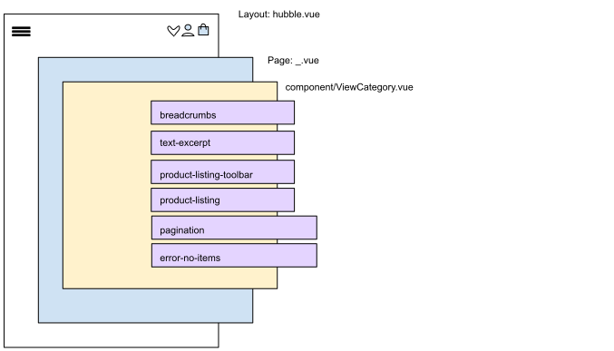
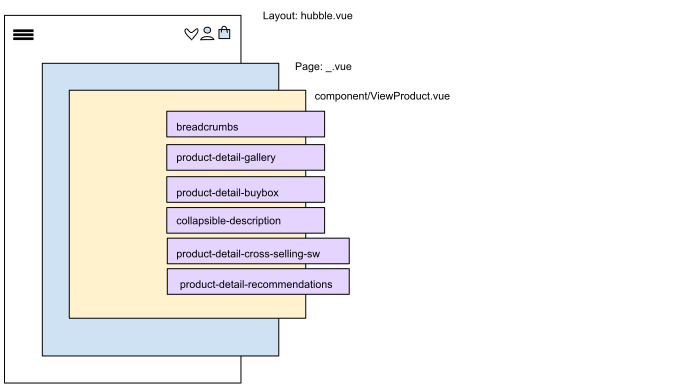

# Page Types

## Kategorieseiten

Für den Inhalt einer Kategorie Seite oder einer Produktliste ist die Komponente __`~components/productlist/ViewCategory.vue`__ zuständig. 
Warum es sich bei diesem Einstiegspunkt nicht um eine Page handelt kann auf der 
Seite [Routing & Dataflow](/pwa/einfuehrung/routing.html#auflosen-von-dynamische-routen) nachgelesen werden.

### Schematischer Aufbau der Kategorieseite:
 

Die primären Komponenten, die __`ViewCategory`__ enthält:
| API | Komponenten | Aufgaben |
| --- | --- | --- | 
| sw / hubble | __`breadcrumbs`__ | zeigt die aktuelle Position in der Navigationsstruktur an |
| hubble | __`text-excerpt`__ | zeigt Excerpt an, wenn ausgeklappt |
| hubble | __`product-listing-toolbar`__ | enthält __`product-listing-filter`__, __`selectable-limit`__, __`selectable-order`__, __`pagination`__, __`selected-facets`__, __`ItemCount`__ |
| hubble | __`product-listing`__ | enthält __`vue-tiny-slider`__, falls __`isSlider`__ prop __`true`__; verwendet  __`product-listing-card`__ um Liste von Produkten (prop __`dataItems`__) darzustellen |
| hubble | __`pagination`__ | zeigt Pagination an, die auf dem Wert __`paginationPerPage`__ aus dem Vuex Store Modul __`modApiRequests`__ basiert |
| hubble | __`error-no-items`__ | zeigt eine Fehlermeldung an, wenn die Produktliste leer ist |
| sw | __`sw-section`__ | stellt Abschnitte (__`sections`__) mit Hilfe von Blöcken (__`~/components/swComponents/blocks/`__) dar, siehe __Darstellung von __`sections`____ für Details |

Im Shopware Kontext wird die Kategorieseite mit Hilfe von Blöcken innerhalb einer __`section`__ dargestellt. 
So können die Erlebniswelt dynamisch dargestellt werden.

## Produktdetailseiten

### Schematischer Aufbau der Produktdetailseite:
 

Für den Inhalt einer Produktdetailseite ist die Komponente __`~components/productdetail/ViewProduct.vue`__ zuständig. 
Warum es sich bei diesem Einstiegspunkt nicht um eine Page handelt kann auf der 
Seite [Routing & Dataflow](/pwa/einfuehrung/routing.html#auflosen-von-dynamische-routen) nachgelesen werden.

Die primären Komponenten, die __`ViewProduct`__ enthält:

| Komponenten | Aufgaben |
| --- | --- | 
| __`breadcrumbs`__ | zeigt die aktuelle Position in der Navigationsstruktur an |
| __`product-detail-gallery`__ | verwendet [vue-tiny-slider](https://www.npmjs.com/package/vue-tiny-slider) & [vue-js-modal](https://www.npmjs.com/package/vue-js-modal) um Produktbilder darzustellen; bindet __`add-to-wishlist`__ ein für Viewports __`sm`__ & __`md`__ |
| __`product-detail-buybox`__ | siehe untere Tabelle |
| __`collapsible-description`__ | nur relevant für __`sm`__ Viewports: zeigt Produktbeschreibung an, wenn im ausgeklappten Zustand; für >__`sm`__ wird die Produktbeschreibung ohne diese Komponente angezeigt  |
| __`product-detail-cross-selling-sw`__ | zeigt Cross-Sellings an, falls vorhanden |
| __`product-detail-recommendations`__ | zeigt Produktempfehlungen mit Hilfe der __`product-listing`__ Komponente an, falls vorhanden|

Die primären Komponenten, die __`product-detail-buybox`__ enthält:

| Komponenten | Aufgaben |
| --- | --- | 
| __`product-detail-manufacturer`__ | stellt Herstellerinformationen, wie Markenname & Logo dar |
| __`product-detail-buybox-options`__ | wird nur eingebunden, wenn Produkttyp __`configurable`__ & wenn [hubble API](../api) in Verwendung (__`process.env.API_TYPE`__ === 'api')|
| __`product-detail-buybox-options-sw`__ | wird nur eingebunden, wenn Produkttyp __`configurable`__ & wenn Shopsystem Shopware (__`process.env.API_TYPE`__ === 'sw')|
| __`product-detail-delivery`__ | zeigt Details zur Versandzeit & zu Versandkosten an |
| __`product-detail-price`__ | stellt Details zum Preis dar; Detaillierungsgrad hängt von dem Produkt ab (Sale Produkte, Mengenabhängige Preise) |
| __`product-detail-add-to-cart`__ | verantwortlich für das Hinzufügen von Produkten zum Warenkorb; verwendet __`Loader`__ & __`material-ripple`__ |
| __`add-to-wishlist`__ | wird nur eingebunden, wenn Viewport __`lg`__, ansonsten Teil der __`product-detail-gallery`__  |

## CMS Seiten

Für den Inhalt einer CMS Seite aus dem Shopbackend wie z.B. einer Landingpage ist die Komponente __`~components/cms/ViewContent.vue`__ zuständig. 
Warum es sich bei diesem Einstiegspunkt nicht um eine Page handelt kann auf der 
Seite [Routing & Dataflow](/pwa/einfuehrung/routing.html#auflosen-von-dynamische-routen) nachgelesen werden.

CMS Seiten oder auch Erlebniswelten sind im Falle von Shopware ebenfalls vom Entitätstyp __Kategorie__, wodurch der __`pageType`__ Wert __`category`__ entspricht.

