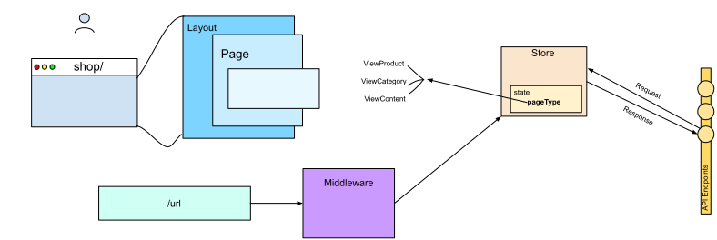

# Routing & Data Flow



## Wie Daten in hubble für Routen bereitgestellt werden

Da hubble's Architektur auf der von NuxtJS basiert, erfolgt die Konfiguration von Routen über das Einhalten der
[Ordner Struktur](https://nuxtjs.org/guide/directory-structure), die NuxtJS vorgibt.

Der Grundaufbau einer Seite lässt sich gut Anhand der Home Page __`~/pages/index.vue`__ ableiten. 
Dieser setzt sich aus den Properties __`name`__, __`layout`__ und __`middleware`__ zusammen. 

``` js{5,11}
// ~/pages/index.vue 
export default {
    name: 'Index',
    layout: 'hubble',
    middleware: [
        'apiIndexRoute',
        'apiAuthenticate',
        'apiLocalization',
        'apiResourceMenu',
        'trackClickPath'
    ],
    // ...
}
```

Alle Seiten haben ein Layout definiert, in dessen Markup der eigentliche Inhalt der Route eingebettet wird. 
In dem Abschnitt [Layouts](layouts.md) erfaren Sie mehr über die in hubble verfügbaren Layouts.

## Serverseitige Auslieferung einer Seite

Die Aufgabe der __Middleware__ in hubble ist es, via Axios, Daten von der Shop API zu beziehen. 
Diese Daten werden dann im jeweiligen Vuex Store Modul gespeichert, wo sie
reaktiv jeder beliebigen Komponente zur Laufzeit der App zur Verfügung stehen. 

Ein weiterer Vorteil ist, dass der Node.js Server somit die Daten als statisches HTML rendern und ausliefern kann.
SEO relevante Informationen stehen also immer im DOM, sodass sie von Suchmaschinen gut lesbar sind.  


::: tip
Um zusätzlichen State für bestimmte Seiten zu definieren, ist eine neue Middleware zu erstellen, die für
Read/Write Operationen Vuex Store Module referenziert und in der __`middleware`__ Option der Seite hinzuzufügen ist.
:::


### Ein Beispiel
Das Menü ist Teil der meisten Seiten, was bedeutet, jene Seiten haben die Middleware __`apiResourceMenu`__ in ihrer
__`middleware`__ Property aufgelistet. Es ist also in diesem Fall Aufgabe der 
Middleware __`apiResourceMenu`__ die Menüdaten bereitzustellen, bevor die Seite gerendert werden kann.


#### Hauptschritte (_vereinfacht_):
* __Schritt 1__: Middleware einer Route wird aufgerufen
``` js{7}
// ~/pages/_.vue
export default {
    name: 'RouteResolver',
    layout: 'hubble',
    middleware: [
        // ...
        'apiResourceMenu',
        // ...
    ],
    // ..
}
```

* __Schritt 2__: Middleware führt Action eines Vuex Store Modules aus 
``` js
// ~/modules/@hubblecommerce/hubble/core/middleware/apiResourceMenu.js
// ...
store.dispatch('modApiMenu/getMenu', {})
// ...
```

* __Schritt 3__: Vuex Store Modul Action bezieht Daten von API Endpunkt 

``` js{3,5,9,14}
// ~/modules/@hubblecommerce/hubble/core/store/api/modApiMenu/getMenu.js
actions: {
    async getMenu({ commit, dispatch }) {
        return new Promise(function(resolve, reject) {
            dispatch('apiCall', {
                action: 'get',
                tokenType: 'api',
                apiType: 'data',
                endpoint: '/api/json/menu/children',
                params: {
                    _size: 30
                }
            }, { root: true })
            .then((response) => {
                commit('setDataMenu', {
                    data: response.data
                });
                // ... 
            })
            // ...
        });
    }
} 
```

* __Schritt 4__: __`layouts/hubble.vue`__

Nachdem die API Response in dem benötigten Format im Vuex State gespeichert wurde, kann die __`layouts/hubble.vue`__, 
welche für das Rendering des Menüs verantwortlich ist, auf diese Daten zugreifen:

``` js
// ~/layouts/hubble.vue
computed: {
   ...mapState({
        dataMenu: state => state.modApiMenu.dataMenu
   })
}
```

Den Unterkomponenten des Layouts können dann als Properties diese Daten übergeben werden:

``` html
<!-- ~/layouts/hubble.vue -->
<the-mega-menu v-if="!isEmpty(dataMenu)" :data-items="dataMenu" />
```

## Clientseitiges Ausliefern von Inhalten

Middlewares in hubble sind nicht die einzige Stelle, an der API Requests initiiert werden: Auch Komponenten rufen
__`actions`__ aus dem Vuex Store auf, die API Requests machen. Das ist nützlich um bestimmte Inhalte erst 
dann von der API zu beziehen wenn sie vom Benutzer angefragt werden z.B. durch ein Klicken etc..


## Auflösen von dynamische Routen

Es gibt zwei verschiedene Arten von Routen in hubble, die sich aus den Dateien im __`~/pages`__ Ordner ergeben.
Zum einen statische Routen wie z.B. __`~/pages/checkout/cart.vue`__ für den Warenkorb und zum anderen dynamische
Routen für z.B. Produktdetailseite, Kategorien oder CMS Seiten. Diese sind dynamisch, weil die PWA zum Zeitpunkt 
zu dem die Seite augerufen wird noch nicht genau weiß, um welche Entität (Produkt, Kategorie, ...) es sich handelt. 
Dynamische Routen werden von __`~/pages/_.vue`__ aufgelöst. 

Die Middleware apiResourceRoute übergibt zunächst die angefragte url an den Enpunkt /api/json/urls/.

``` js
// ~/pages/_.vue
middleware: [
    ...
    'apiResourceRoute',
    ...
],
```

``` js
// middleware/api/apiResourceRoute.js
store.dispatch('apiCall', {
    action: 'get',
    tokenType: 'api',
    apiType: 'data',
    endpoint: _.join(['/api/json/urls/', path], '')
}, {root: true})
.then(response => {
    // Throw 404 page if url is not known
    if (_.isEmpty(response.data.result.item)) {
        error({statusCode: 404, message: 'Unknown URL'});
        resolve('UriResolver OK');
        return false;
    }

    // Get resource by id from api and set matching pageview component
    store.dispatch('modApiResources/apiResolveUriData', {
        data: response.data,
        query: route.query
    })
    .then(() => {
        resolve('UriResolver OK')
    })
    .catch(() => {
        reject()
    })
})
```


Dieser liefert dann den Seitentypen bzw. die Entität zurück um die es sich handelt. 
Gleichzeitig werden von der API alle relevanten Daten bezüglich der Entität bezogen (modApiResources/apiResolveUriData).

Die Seite __`~/pages/_.vue`__ kann nun anhand des Pagetypes und der Daten der Entität die Seite rendern:

``` vue
<!-- ~/pages/_.vue -->
<component :is="currentComponent" v-if="pageType !== null" />
```


## Unterschiedliche Shopsystemen, gleiche Funktionsaufrufe

Damit die Komponenten und Middleware Plattform unabhängig bleiben, werden immer die gleichen Funktionsaufrufe in den
Store Modules benutzt egal um welches System es sich handelt. Folgender Mechanismus macht es möglich: 
Das hubble Modul (__`~/modules/@hubblecommerce/hubble/module.js`__) wird bei Start der Applikation aufgerufen
und anhand des in der __`.env`__ eingetragenen __`API_TYPE`__ werden die entsprechenden Shop spezifischen Dateien aus 
dem Unterordner __`sw`__ oder __`api`__ registriert. Dadurch entfällt der Pfad Prefix für Shop spezifische Vuex Store
Module, da es in der laufenden Applikation nur ein Store Modul mit dem jeweiligen Namen gibt.

##### Mehr Erfahren
Um mehr über State Management in hubble zu erfahren kann der Abschnitt [State Management](statemanagement.md) 
der Dokumentation referenziert werden.

