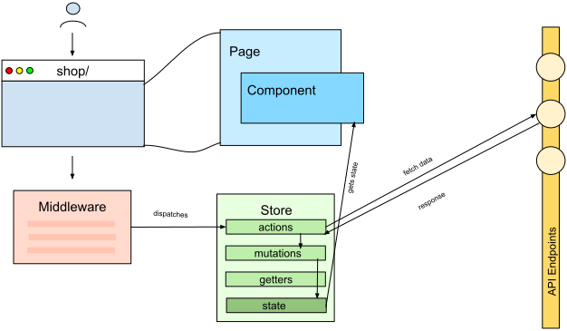

# State Management

### Architektur und State Management 



Hubble verwendet [Vuex](https://vuex.vuejs.org/), unter der Anwendung einer Modulstruktur, als Hauptlösung für das State Management.
Die Store Module beinhalten die von den Seiten und Komponenten benötigten Daten in dem jeweiligen __`state`__ Objekt
und werden somit für alle __Read/Write__ Operationen verwendet. Dafür existieren verschiedene Arten von Funktionen,
die für die jeweilige Tätigkeit aufgerufen werden: __`getters`__, __`actions`__ und __`mutations`__.
Dieser Konvention von Vuex folgend werden somit alle Store Interaktionen nur über die passende Funktionsart durchgeführt.  

::: tip
Für eine vereinfachte Syntax werden in hubble sogenannte Vuex __map helper__ verwendet.
:::

Die in hubble verwendete Syntax zur Referenzierung von Store Funktionen:
``` js
// ~/components/customer/LoginForm.vue (simplified)
export default {
    methods: {
        ...mapActions({
            logIn: 'modApiCustomer/logIn' // maps action to local function
        }),
        submitLoginForm: function() {
            // ...
            this.logIn(validCredentials) // uses mapped action function
            // ...
        }
    }
} 
```

#### Arten von Store Modulen

Zusätzlich zu der generellen Unterteilung von Shop Funktionalitäten, wie z.B. Warenkorb und Wunschliste,
in unterschiedliche Module, gibt es außerdem Shop spezifische Module, die jeweils in den Modul Unterordnern
__`sw`__ und __`api`__ hinterlegt sind. Der Warenkorb gehört dabei zu den Shop spezifischen und die Wunschliste
zu den allgemeingültigen Modulen.

| Store Modul | Verwendung |
| --- | --- | 
| __`hubble/core/store/modApi.js`__ | gültig für alle Shopsysteme |
| __`hubble/core/store/api/modApiProduct.js`__ | gültig nur für den API Typ '__api__' ([hubble API](../api)) |
| __`hubble/core/store/sw/modApiProduct.js`__ | gültig nur für den API Typ '__sw__' |

::: tip
Für Funktionalitäten, die von dem gewählten Shopsystem abhängen, sind in hubble unterschiedliche Ordner mit denselben
Modul- und Funktionsnamen verfügbar.
:::


#### Einbindung von Shop spezifischen Store Modulen
Dieser Teil wird auch im Abschnitt [Lazy Loading](lazyloading.md) erläutert.

Das hubble Modul (__`~/modules/@hubblecommerce`__) wird bei Start der Applikation aufgerufen (__`~/modules/@hubblecommerce/hubble/module.js`__)
und anhand der in der __`.env`__ eingetragenen __`API_TYPE`__ werden die entsprechenden Shop spezifischen Dateien aus 
dem Unterordner __`sw`__ oder __`api`__ registriert. Dadurch entfällt der Pfad Prefix für Shop spezifische Vuex Store
Module, da es in der laufenden Applikation nur ein Store Modul mit dem jeweiligen Namen gibt.

Zum Referenzieren von Store Modulen in Komponenten:
``` js
// ~/components/customer/LoginForm.vue (simplified)
...mapActions({
    logIn: 'modApiCustomer/logIn' // name of module === 'modApiCustomer', name of action === 'logIn'
})
```

::: tip
Der Store ist in hubble über ein eigenes Modul, mit dem Namen __`@hubblecommerce`__ eingebunden und befindet sich unter 
```
~/modules/@hubblecommerce/hubble/store
```
:::


Für Details zur Funktionsweise von [Modulen in NuxtJS](https://nuxtjs.org/guide/modules) kann die offizielle NuxtJS Dokumentation
referenziert werden.

Für eine detaillierte Beschreibung der Funktionsweise von State Management in Vuex und spezifisch im Kontext von Nuxt können die folgenden offiziellen
Ressourcen referenziert werden:

* [Vuex](https://vuex.vuejs.org/) 
* [Vuex Store in Nuxt](https://nuxtjs.org/guide/vuex-store)
