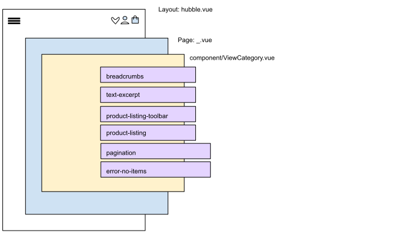

# Produkte

Produkte können primär als Teil von vier Seitenarten dargestellt werden:
+ [Kategorieseiten](./products.md#kategorieseiten)
+ [Produktdetailseiten](./products.md#produktdetailseiten)
+ [CMS Seiten](./products.md#cms-seiten)
+ [Katalogsuche](./products.md#katalogsuche)

### Kategorieseiten

Das Rendering von Kategorieseiten geschieht durch die __`~/pages/_.vue`__. Da die __`~/pages/_.vue`__ für alle dynamischen Routen verantwortlich ist, wird als Unterscheidungskriterium die __`state`__ Variable 
__`pageType`__ aus dem Vuex Store verwendet. Der Wert von __`pageType`__ ergibt sich aus dem API Response Objekt. Das Request dazu wird durch die Middleware __`apiResourceRoute`__ initiiert.
Für Kategorieseiten ist der __`pageType`__ Wert __`category`__, wordurch die Komponente __`ViewCategory`__ eingebunden wird. 




Die primären Komponenten, die __`ViewCategory`__ enthält:

| Komponenten | Aufgaben |
| --- | --- | 
| __`breadcrumbs`__ | zeigt die aktuelle Position in der Navigationsstruktur an |
| __`text-excerpt`__ | zeigt Excerpt an, wenn ausgeklappt |
| __`product-listing-toolbar`__ | enthält __`product-listing-filter`__, __`selectable-limit`__, __`selectable-order`__, __`pagination`__, __`selected-facets`__, __`ItemCount`__ |
| __`product-listing`__ | enthält __`vue-tiny-slider`__, falls __`isSlider`__ prop __`true`__; verwendet  __`product-listing-card`__ um Liste von Produkten (prop __`dataItems`__) darzustellen |
| __`pagination`__ | zeigt Pagination an, die auf dem Wert __`paginationPerPage`__ aus dem Vuex Store Modul __`modApiRequests`__ basiert |
| __`error-no-items`__ | zeigt eine Fehlermeldung an, wenn die Produktliste leer ist |


#### Die __`product-listing-card`__ Komponente

Die primären Komponenten, die __`product-listing-card`__ enthält:
            
| Komponenten |
| --- |
| __`add-to-wishlist`__ | 
| __`product-listing-card-options-non-interactive`__ | 
            


### Produktdetailseiten


Produktdetailseiten gehören zu den Seitenarten, die über  __`~/pages/_.vue`__ gerendert werden.
Da die __`~/pages/_.vue`__ für alle dynamischen Routen zuständig ist, wird dort als Unterscheidungskriterium die __`state`__ Variable __`pageType`__ aus dem Vuex Store verwendet.
Der Wert von __`pageType`__ ergibt sich aus dem API Response Objekt. Das Request dazu wird durch die Middleware __`apiResourceRoute`__ initiiert.
Im Falle von Produktdetailseiten, ist der __`pageType`__ Wert __`product`__, was zu der Einbindung der Komponente __`ViewProduct`__ führt.

Die primären Komponenten, die __`ViewProduct`__ enthält:

| Komponenten | Aufgaben |
| --- | --- | 
| __`breadcrumbs`__ | zeigt die aktuelle Position in der Navigationsstruktur an |
| __`product-detail-gallery`__ | verwendet [vue-tiny-slider](https://www.npmjs.com/package/vue-tiny-slider) & [vue-js-modal](https://www.npmjs.com/package/vue-js-modal) um Produktbilder darzustellen; bindet __`add-to-wishlist`__ ein für Viewports __`sm`__ & __`md`__ |
| __`product-detail-buybox`__ | siehe untere Tabelle |
| __`collapsible-description`__ | nur relevant für __`sm`__ Viewports: zeigt Produktbeschreibung an, wenn im ausgeklappten Zustand; für >__`sm`__ wird die Produktbeschreibung ohne diese Komponente angezeigt  |
| __`product-detail-cross-selling-sw`__ | zeigt Cross-Sellings an, falls vorhanden |
| __`product-detail-recommendations`__ | zeigt Produktempfehlungen mit Hilfe der __`product-listing`__ Komponente an, falls vorhanden|


Die primären Komponenten, die __`product-detail-buybox`__ enthält:

| Komponenten | Aufgaben |
| --- | --- | 
| __`product-detail-manufacturer`__ | stellt Herstellerinformationen, wie Markenname & Logo dar |
| __`product-detail-buybox-options`__ | wird nur eingebunden, wenn Produkttyp __`configurable`__ & wenn [hubble API](../api) in Verwendung (__`process.env.API_TYPE`__ === 'api')|
| __`product-detail-buybox-options-sw`__ | wird nur eingebunden, wenn Produkttyp __`configurable`__ & wenn Shopsystem Shopware (__`process.env.API_TYPE`__ === 'sw')|
| __`product-detail-delivery`__ | zeigt Details zur Versandzeit & zu Versandkosten an |
| __`product-detail-price`__ | stellt Details zum Preis dar; Detaillierungsgrad hängt von dem Produkt ab (Sale Produkte, Mengenabhängige Preise) |
| __`product-detail-add-to-cart`__ | verantwortlich für das Hinzufügen von Produkten zum Warenkorb; verwendet __`Loader`__ & __`material-ripple`__ |
| __`add-to-wishlist`__ | wird nur eingebunden, wenn Viewport __`lg`__, ansonsten Teil der __`product-detail-gallery`__  |

### CMS Seiten

CMS Seiten sind im Falle von Shopware ebenfalls vom Entitätstyp __Kategorie__, wodurch der __`pageType`__ Wert __`category`__ entspricht.


### Struktur der __`~/pages/_.vue`__

Das Template *(vereinfacht)*, welches __`ViewCategory`__ für [Kategorieseiten](pagetypes.md#kategorieseiten),
__`ViewProduct`__ für [Produktdetailseiten](pagetypes.md#produktdetailseiten) und  __`ViewContent`__ für [CMS Seiten](pagetypes.md#cms-seiten) einbindet:
``` html
<!-- ~/pages/_.vue -->
<component :is="currentComponent" v-if="pageType !== null" />
```

Das Skript *(vereinfacht)*:
``` js
// ~/pages/_.vue
import { mapState } from 'vuex';

export default {
    name: 'RouteResolver',
    // lazily loads only needed component
    components: {
        ViewCategory: () => import('../components/productlist/ViewCategory'),
        ViewProduct: () => import('../components/productdetail/ViewProduct'),
        ViewContent: () => import('../components/cms/ViewContent')
    },
    // uses default layout 
    layout: 'hubble',
    data () {
        return {
            // determines the component that will be rendered in template
            currentComponent:  ''
        }
    },
    // maps state from vuex store to select component that needs to be imported
    computed: {
        ...mapState({
            pageType: state => state.modApiResources.pageType    
        })
    },
    // sets component that needs to be imported
    created () {
        this.currentComponent = 'view ' + this.pageType;
    },
    // responsible for initiating state initialization before dynamic route gets rendered
    middleware: [
        // ...
        // initiates pageType state value to be set
        'apiResourceRoute'
    ],
    // ...
}
```

### Katalogsuche

Das Rendering der Katalogsuche geschieht durch die __`~/pages/search/catalogsearch.vue`__, welche für Darstellung die __`view-catalogsearch`__ Komponente eingebunden hat.
Der von der __`view-catalogsearch`__ Komponente benötigte __`state`__ (z.B. für den Suchbegriff gefundene Produkte) wird durch die Initiierung der Middleware __`apiResourceSearch`__ gesetzt.

Die primären Komponenten, die __`ViewCatalogsearch`__  enthält:
| Komponenten | Aufgaben |
| --- | --- | 
| __`product-listing-toolbar`__ | wird nur eingebunden, wenn [hubble API](../api) in Verwendung (__`process.env.API_TYPE`__ === 'api')|
| __`product-listing`__ | enthält __`vue-tiny-slider`__, falls __`isSlider`__ prop __`true`__; verwendet  __`product-listing-card`__ um Liste von Produkten (prop __`dataItems`__) darzustellen |
| __`pagination`__ | zeigt Pagination an, die auf dem Wert __`paginationPerPage`__ aus dem Vuex Store Modul __`modApiRequests`__ basiert |