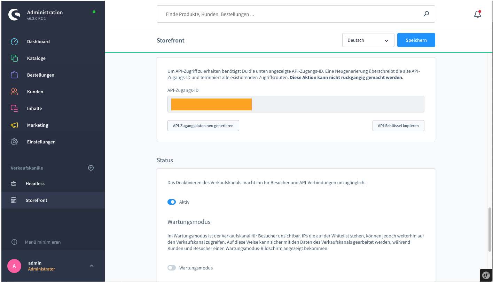

# Kickstart mit Shopware 6

## Backend

Für Shopware 6 als Backend bietet hubble eine direkt nutzbare Integration.

Shopware's [Sales Channel](https://docs.shopware.com/en/shopware-platform-dev-en/sales-channel-api) und [Store API](https://docs.shopware.com/en/shopware-platform-dev-en/store-api-guide)'s werden direkt über das __`@hubblecommerce`__ Modul angesprochen.

::: tip
__Hinweis:__ Die folgenden Installationsanweisungen wurden für MacOS und Linux Umgebungen getestet.
:::

## Requirements

* [Node.js](https://nodejs.org/en/) \(&gt;=10.20.1\)
* __npm__ \(&gt;=6.14.4\)
* [Shopware >= 6.3.0](https://docs.shopware.com/en/shopware-platform-dev-en/system-guide/system-installation-guides)
* [Shopware 6 PWA Plugin](https://github.com/elkmod/SwagShopwarePwa)
* [Shopware 6 Payone Plugin](https://store.shopware.com/payon69044615910f/payone-payment-fuer-shopware-6.html)
* [NuxtJS Projekt](https://nuxtjs.org/)


## Installation und Konfiguration des hubble Moduls

Das hubble Modul ist vefügbar als [npm](https://www.npmjs.com/) Package und kann über das Terminal via __`npm`__ heruntergeladen 
und als [Nuxt Modul](https://nuxtjs.org/guide/modules/) in NuxtJS Projekten eingebunden werden:

1. Install [NuxtJS](https://nuxtjs.org/guides/get-started/installation)
2. Install hubble NuxtJs Module 
```sh
npm i @hubblecommerce/hubble
```
3. Add module to nuxt.config.js
```js
buildModules: [
    ['@hubblecommerce/hubble']
],

/*
 ** hubble module configuration
 */
hubble: {
    apiType: process.env.API_TYPE
},
```

Um die Entwicklung zu beginnen wird eine __`~/.env`__ benötigt, in die Credentials wie API Keys und Auth Token
aus den Admin Bereichen der jeweiligen Services einzutragen sind.
Mehr zur .env unter: [Konfiguration](../pwa/configuration.md).

Im Zusammenhang mit Shopware sind mindestens folgende Einträge notwendig:

```dotenv
API_TYPE          = 'sw'
API_SW_ACCESS_KEY = 'ENTER_YOUR_ACCESS_KEY_HERE'
API_BASE_URL      = 'http://shopware.local'
```
Dabei ist zu beachten, dass der __`API_SW_ACCESS_KEY`__ für den Storefront Verkaufskanal eingetragen wird und __nicht__ für den
Headless Verkaufskanal, denn die Headless Variante liefert zur Zeit keine SEO URLs.

 

## Starten der hubble PWA im Entwicklungsmodus
``` bash
npm run dev
```
Das hubble Frontend ist nun unter __`http://localhost:3336/`__ einsehbar.


## Starten der hubble PWA im Production Modus
``` bash
npm run build
npm run start
```
