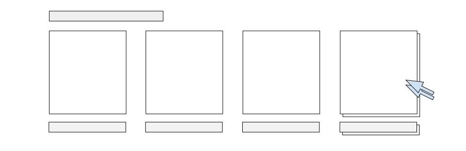

# Entwicklung des Features "Zuletzt angesehene Produkte"

#### Beschreibung
Im Folgenden wird die Komponente zur Darstellung der zuletzt besuchten Produktdetailseiten erstellt.
Die Komponente soll Teil dieser Seite werden und soll bei jedem Aufruf von einer Produktdetailseite
um das aktuelle Produkt erweitert werden. Außerdem soll diese Liste auch ebenfalls verfügbar sein bei
Seitenbesuchen zu einem späteren Zeitpunkt,
insofern der Browserspeicher nicht gelöscht wurde oder die Speicherzeit nicht überschritten wurde. Außerdem 
sollen die Produkte, aus der Komponente heraus, direkt aufrufbar sein.

Somit existieren folgende Anforderungen:

+ Die Navigation auf eine Produktdetailseite soll dieses Produkt dem Vuex Store State hinzufügen.
+ Der zugehörige State aus dem Vuex Store soll im Browser für eine bestimmte Zeit (Lifetime) zwischengespeichert werden.
+ Dieser im Browser zwischengespeicherte State soll mit dem Vuex State synchronisiert sein,
auch wenn der Shop zu einem späteren Zeitpunkt besucht wird.
+ Es soll nur eine bestimmte begrenzte Anzahl an zuletzt angesehenen Produkten angezeigt und gespeichert werden.
+ Es sollen sich keine doppelten Einträge in der Liste befinden.
+ Listeneinträge in der Komponente sollen bei Auswahl auf Produktdetailseiten weiterleiten.
+ Die Komponente soll auf allen Geräten angemessen dargestellt werden.

::: tip
Es existieren immer mehrere Möglichkeiten, dieselbe Funktionalität zu erreichen. Dieser Guide beginnt mit einer Variante, um 
verschiedene Implementationsmöglichkeiten in hubble vorzustellen und passt den bestehenden Ansatz im Laufe des Guides an.
:::

#### What you'll learn
+ State Management in hubble
+ Existierende Middleware und Vuex Store Module aus dem __`@hubblecommerce`__ Modul effizient editieren
+ In hubble eingebundenes Nuxt Modul [localforage-nuxt](https://www.npmjs.com/package/localforage-nuxt) verwenden, um mit vorhandenen Daten zu arbeiten
+ Besonderheiten, die beim serverseitigen und clientseitigen Rendering jeweils zu beachten sind
+ Styling einer Komponente in hubble


## Implementation

Es gibt zwei primäre Bereiche bei der Umsetzung der oben definierten Anforderungen:
Zum einen wird eine Vue Komponente benötigt, die relevante Daten darstellen kann und an entsprechender Stelle eingebunden ist.
Zum anderen muss der State verwaltet, gespeichert und für die Komponente zur Darstellung erreichbar sein.

### Anlegen des Vuex Store Moduls __`~/store/modLastViewed.js`__

Die Daten für ein Produkt, dessen Detailseite besucht wird, werden in der Middleware __`apiResourceRoute`__ bei serverseitigem
Rendering und bei clientseitigem Rendering direkt in der __`modApiProduct`__ dem Vuex Store State hinzugefügt.  
Außerdem wird hier jeweils auch der __`pageType`__ auf __`product`__ gesetzt, womit die __`ViewProduct`__ Komponente gerendert wird.
Diese enthält alle Komponenten zur Darstellung der Produktdetailseite.

``` js{4,5,8,13}
// `~/modules/@hubblecommerce/hubble/core/middleware/sw/apiResourceRoute.js
return new Promise((resolve, reject) => {
    store.dispatch('modApiProduct/mappingProduct', { product: matchingProduct })
        .then((res) => {
            store.commit('modApiProduct/setDataProduct', {
                data: {
                    result: {
                        item: res
                    }
                }
            });
        
            store.commit('modApiResources/setPageType', 'product');
        
            resolve('ok');
        });
});
```

Jene Daten, gilt es nun der Liste zuletzt angesehener Produkte hinzuzufügen. Diese Liste sollte im Vuex Store
State definiert sein und eine entsprechende Funktion im __`mutations`__ Objekt zum Setzen erhalten.
Außerdem sollten weder redundate Listeneinträge hinzugefügt werden, noch eine maximal Anzahl (maximal 4) überschritten werden.

Neue Store Module sind in dem Ordner __`~/store`__ zu erstellen, wobei der gesetzte Dateiname dem Modulnamen
entspricht und z.B. in Komponenten und anderen Store Modulen zur Referenzierung verwendet wird.
Es existieren auch andere Schreibweisen und Organisationsmöglichkeiten, die in der offiziellen NuxtJS Dokumentation näher
erläutert sind ([Vuex Store in NuxtJS](https://nuxtjs.org/guides/directory-structure/store)).

Zum Anlegen des neuen Store Moduls __`~/store/modLastViewed.js`__ (wird im Laufe dieses Guides erweitert) kann
folgende Schreibweise aus der NuxtJS Dokumentation verwendet werden:

``` js
// ~/store/modLastViewed.js
// will be used for its array utility functions
import _ from 'lodash';

export const state = () => ({
    viewedProducts: []
})
export const mutations = { 
    addLastViewedProducts: (state, payload) => {
        let alreadyIncluded = state.viewedProducts.filter((viewedProduct) => viewedProduct.id === payload.id);

        if (alreadyIncluded.length === 0) {
            if (state.viewedProducts.length === 4) {
                let slicedArray  = _.slice(state.viewedProducts, 1);

                slicedArray.push(payload);

                state.viewedProducts = slicedArray;
            } else {
                state.viewedProducts.push(payload);
            }
        } else {
            let uniqueVisits = _.uniqBy(state.viewedProducts, product => product.id);

            if (state.viewedProducts.length <= 4) {
                state.viewedProducts = uniqueVisits;
            } else {
                state.viewedProducts = _.slice(uniqueVisits, 1);
            }
        }
    }
}
export const actions = { }
```


### Anlegen der Komponente __`LastViewedProducts`__




__Das Template der Komponente__:
``` html
<template>
    <div class="last-viewed--wrp">
        <div class="last-viewed--title">Last Viewed Products</div>
        <div class="last-viewed--list">
            <div v-for="product in viewedProducts" :key="product.id">
                <a :href="'/' + product.url_pds">
                    
                    <div class="last-viewed--name">{{ product.name }}</div>
                </a>
            </div>
        </div>
    </div>
</template>
```


__Der Skriptteil der Komponente, welcher unter anderem die benötigten Daten referenziert__:
+ Verwendung von __`mapState`__, um zu rendernde Daten aus dem Vuex Store State zu laden
``` js
import { mapState } from "vuex";

export default { 
    name: "LastViewedProducts",

    computed: {
        ...mapState({
            viewedProducts: state => state.modLastViewed.viewedProducts
        })
    }
}
```


### Einbinden der Komponente 
Da die neue Komponente in der Produktdetailseite sichtbar sein soll, und diese wie oben erläutert von der
__`ViewProduct`__ angezeigt wird, sollte die __`LastViewedProducts`__ Komponente also in der 
__`~/components/productdetail/ViewProduct.vue`__ eingebunden werden.

Zur Verwendung im Template, muss die Komponente importiert und registriert werden:
``` js
import LastViewedProducts from "../productutils/LastViewedProducts";
```

``` js
export default { 
    components: {
        LastViewedProducts
    }
}
```

Nun kann die Komponente an gewünschter Stelle im Template eingebunden werden:
``` html
<!-- ~/components/productdetail/ViewProduct.vue -->
<div>
    <last-viewed-products />
</div>
```


### Verwendung des Vuex Stores

Momentan steht zwar Funktionalität zur Anzeige der zuletzt besuchten Produktdetailseiten zur Verfügung, jedoch
wird diese Funktionalität nicht verwendet und somit erscheint nur die Überschrift der  __`LastViewedProducts`__
Komponente.
Die Stelle, an der die korrekten Produkt Informationen aus der API geparsed werden, wurde bereits weiter oben identifiziert:
Es werden jeweils ein Aufruf der __`mutation`__ __`addLastViewedProducts`__ in der Middleware __`apiResourceRoute`__ und
in dem Vuex Store Modul __`modApiProduct`__  benötigt.

``` js
commit('modLastViewed/addLastViewedProducts', { name: res.name, id: res.id, url_pds: res.url_pds, image: res.image }, { root: true });
``` 

Da diese beiden Dateien sich jedoch im __`@hubblecommerce`__ Modul befinden, sollten diese nicht direkt editiert werden,
damit das Modul updatefähig bleibt.

__Hinweis: Dies ist eine mögliche Variante, dieses Feature einzubinden. Im Laufe dieses Guides,
wird eine weitere Möglichkeit vorgestellt, die auf dieser Variante basiert.__


### Überschreiben von existierenden Store Modulen
Um bestehende Store Module zu verändern, ist es notwendig eine neue Datei mit demselben Namen unter dem __`~/store`__
Ordner anzulegen und das ursprüngliche Modul zu deaktivieren:

__1. Anlegen einer neuen Datei__

Um die Basisfunktionalität zu erhalten ist der Inhalt der __`modApiProduct`__ in die neue Datei zu kopieren.


__2.Deaktivieren des Store Moduls in der __`nuxt.config.js`____

``` js
hubble: {
    // ...
    deactivateStores: ['modApiProduct.js'],
    // ...
}
```

Der __`mutation`__ Aufruf kann nun in die neue Datei eingebunden werden.

### Überschreiben von existierender Middleware
Das Editieren von existierender Middleware entspricht dem gleichen Schema zur Überschreibung von existieren Store
Modulen: Es ist notwendig eine Datei mit demselben Namen im Ordner __`~/middleware`__ zu erstellen, die bestehenden Inhalte in die
neue Datei einzufügen und die ursprüngliche Middleware zu deaktivieren.

__1. Das Anlegen einer neuen Datei__

Um die Basisfunktionalität zu erhalten ist der Inhalt der __`modApiProduct`__ in die neue Datei zu kopieren.

__2. Das Deaktivieren der Middleware aus dem __`@hubblecommerce`__ Modul in der __`nuxt.config.js`____
``` js
hubble: {
    // ...
    deactivateMiddleware: ['apiResourceRoute.js'],
    // ...
}
```
Nun kann auch hier der __`mutation`__ Aufruf in die neue Datei eingebunden werden.

### Verwenden von __`$localForage`__
Nachdem der __`mutation`__ Aufruf nun in die neuen Dateien eingebunden wurde, werden beim Besuchen von Produktdetailseiten 
diese Produkte der __`viewedProducts`__ Liste zwar hinzugefügt, jedoch ist bei einem Refresh der Seite oder bei 
einem späteren Aufruf des Shops die Liste wieder leer.
Um zumindest für einen bestimmten Zeitraum einen gewissen Grad an Persistenz zu erreichen, kann das in hubble eingebundene
Nuxt Modul [localforage-nuxt](https://www.npmjs.com/package/localforage-nuxt) verwendet werden.

#### Speichern via __`$localForage`__
Um die angesehenen Produkte, die sich im Vuex Store State in der Liste __`viewedProducts`__ befinden, wird eine
Vuex Store Funktion vom Typ __`action`__ benötigt. Außerdem muss ein Name zur zukünftigen Referenz
und eine Gültigkeitsdauer angegeben werden, bei der Verwendung dieser Speichervariante. Dafür bietet sich der Store
State an.

Somit ist das Store Modul dafür wie folgt zu ergänzen:
``` js
// ~/store/modLastViewed.js
import localStorageHelper from "~/modules/@hubblecommerce/hubble/core/utils/localStorageHelper";

export const state = () => ({
    // ...
    cookieName: 'hubbleLastViewed',
    localStorageLifetime: 720, // 720 hours = 30 days,
}

export const actions = {
    saveViewedProductsToLocalForage({ commit, state, dispatch }, payload) {
        return new Promise((resolve, reject) => {
                // localStorageHelper is a utility helper function in hubble
                localStorageHelper.setCreatedAt(state.viewedProducts, state.localStorageLifetime)
                    .then((response) => {
                        this.$localForage.setItem(state.cookieName, state.viewedProducts);

                        resolve("viewed products saved to localForage");
                    })
        })
    }
}
```
Dadurch wird die Liste zwar gespeichert, jedoch sind z.B. bei einem Refresh noch keine sichtbaren Unterschiede auf der UI.
Jedoch kann zumindest der __Inspect Mode__ des Browser verwendet werden, um auf den Browserspeicher zuzugreifen und die Abspeicherung
zu überprüfen.


#### Abrufen via __`$localForage`__
Damit die im Browserspeicher vorhandenen Daten abgerufen werden können, sind primär zwei Schritte notwendig.
Zum einen muss eine Vuex Store Funktion vom Typ __`action`__ erstellt werden, die den Vuex State mithilfe einer
__`mutation`__ setzt und zum anderen muss diese __`action`__ an der korrekten Stelle abgerufen werden, damit der State
zur Darstellung zur Verfügung steht.

1. Als Erstes sollte die benötigte __`action`__ erstellt werden. 

__Hinweis: Hier ist der __`mutation`__ Aufruf bereits eingebunden, wird jedoch erst im nächsten Schritt implementiert.__
``` js
export const actions = {
    // ... 
    setByForage({commit, state, dispatch}) {
        return new Promise((resolve) => {
            this.$localForage.getItem(state.cookieName).then((response) => {
                if(response !== null) {
                    // Remove local storage if its invalid (end of lifetime)
                    if(!localStorageHelper.lifeTimeIsValid(response, state.localStorageLifetime)) {
                        this.$localForage.removeItem(state.cookieName);
    
                        resolve({
                            success: true,
                            message: 'local storage was cleared for its invalidity',
                            redirect: true
                        });
                    }
                    // mutation that will be created next:
                    commit('addLastViewedProductsComingFromForage', response);
    
                    dispatch('saveViewedProductsToLocalForage');
    
                    resolve({
                        success: true,
                        message: 'lastviewedproducts list taken from forage.',
                        redirect: true
                    });
                }
    
                resolve({
                    success: true,
                    message: 'lastviewedproducts list not known by forage.'
                });
            });
        })
    }
}
```
2. Als nächstes sollte nun die in der __`action`__ __`setByForage`__ aufgerufene __`mutation`__ erstellt werden:

``` js
export const mutations = {
    // ...
    addLastViewedProductsComingFromForage: (state, payload) => {
        _.forEach(state.viewedProducts, (viewedProduct) => payload.push(viewedProduct));

        let uniqueVisits = _.uniqBy(payload, product => product.id);

        // remove oldest entry if maxLength is exceeded
        if (uniqueVisits.length > 4) uniqueVisits = _.slice(uniqueVisits, 1);

        state.viewedProducts = uniqueVisits;
    }
}
```

3. Zum Aufruf der __`action`__ __`setByForage`__ an der korrekten Stelle, gilt es folgendes zu beachten:
Da beim initialen Seitenaufruf das Rendering auf dem Server stattfindet, kann in diesem Schritt
kein Abruf der Daten via __`$localForage`__ im Browser stattfinden. Denn dort sind die zuletzt besuchten Produktdetailseiten
abgespeichert. Um diese Daten nun aus dem Browserspeicher in den lokalen Vuex State zu laden, kann jedoch die [Plugin Funktionalität
von Nuxt.js](https://nuxtjs.org/guides/directory-structure/plugins) verwendet werden:
Diese wird nach der Middleware und immer clientseitig ausgeführt. 
Unter Verwendung des gleichen Schemas werden, unter anderem, ebenfalls der Warenkorb und auch die Wunschliste aus dem
Browserspeicher geladen. Im __`@hubblecommerce`__ Modul befindet sich diese clientseitige Initialisierung unter 
__`~/modules/@hubblecommerce/hubble/core/plugins/sw/nuxt-client-init_no_ssr.js`__. 
Für die analoge Implementation für das Laden der zuletzt angesehenen Produkte sind folgende Schritte notwendig:

__a. Die Erstellung der Plugin Datei__
``` 
~/plugins/clientside-initialization.js
```
   
__b. Der Funktionsaufruf der zugehörigen Vuex Store __`action`____ 
``` js
export default async (context) => {
    await context.store.dispatch('modLastViewed/setByForage', context);
}
```

## Styling der Komponente
### Anlegen der __`.scss`__ Datei
Um nun die __`LastViewedProducts`__ Komponente zu Stylen ist der Konvention des hubble Starterprojektes folgend
eine __`.scss`__ Datei mit dem Namen der Komponente in der
__`~/assets/scss/hubble/components`__ zu erstellen. Die Namensgebung und Einbindung im __`components`__ Ordner ist optional
und kann von der Konvention abweichen.

__Hinweis: __`~/assets/scss/hubble/`__ ist der Theme Ordner, der in der __`.ENV`__ angegeben wurde __`THEME = 'hubble'`__.__

In dieser Datei können nun die Klassen aus dem Template
verwendet werden, um ein gewünschtes Styling zu definieren. Mit dem mobile-first Ansatz, werden dabei als Erstes alle Styles für mobile
Viewports definiert und nur Änderungen, die sich für non-mobile Screens ergeben via Media Queries eingebunden. 
Außerdem können die im hubble Projekt definierten Sass Variablen verwendet werden, um z.B. wie im Folgenden die
Schriftgröße zu setzen (__`$font-size-subtitle`__).

Die __`last-viewed-products.scss`__ Datei hat somit folgenden generellen Aufbau (vereinfacht dargestellt):

``` scss
/* ~/assets/scss/hubble/components/last-viewed-products.scss */
.last-viewed--wrp {
    .last-viewed--title { ... }

    .last-viewed--list {
        display: flex;
        flex: 1;
        flex-wrap: wrap;

        .last-viewed--clickable {
            ...

            a {
                display: flex;
                flex-direction: column;
                height: 100%;
                justify-content: space-between;
            }
        }

        .last-viewed--name {
            font-size: $font-size-subtitle;
            font-weight: 700;
            text-align: center;
            align-self: center;
            padding: 5px 0
        }
    }
}

@media(min-width: 768px) {
    .last-viewed--wrp {
        .last-viewed--title { ... }

        .last-viewed--list {
            justify-content: space-between;

            .last-viewed--clickable { ... }

            .last-viewed--image {
                height: 150px;
            }

            .last-viewed--name {
                align-self: flex-end;
            }
        }
    }
}

```


### Einbinden in den Kompilierungsprozess
Die Styles sind an dieser Stelle zwar definiert, jedoch haben diese keine Auswirkungen auf die sichtbare UI. 
Neue Sass Dateien müssen erst als Teil der Kompilierung von __`.scss`__ zu __`.css`__ definiert werden.
Zum Einbinden der neuen __`.scss`__ Datei in den Kompilierungsprozess, ist diese in der __`~/assets/scss/hubble/all.scss`__ zu importieren:
``` scss
@import "components/last-viewed-products";
```
Dies gehört zur Vorkonfiguration in hubble und ist somit nicht optional, zumindest insofern die Default Projekt Einstellungen verwendet werden.


